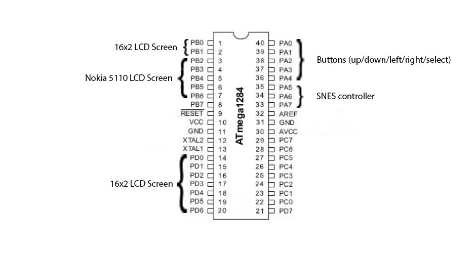

# Countdown - UCR EE/CS 120B Final Project

This is my UCR EE/CS120B Embedded Systems Final project for Spring 2018. 
My project is a custom implementation of the gameshow Countdown on an ATMEL ATMEGA1284 Microcontroller. 
Countdown is a math-based British TV game show that has the participants compete to use all given numbers in a math equation to equal a set number in a given amount of time (usually 30 seconds). For example, the contestants are given the numbers

1 2 and 3, and the math equation must equal 6, one possible answer would be

1 + 2 + 3 = 6

See this video for a clip of the show:

https://www.youtube.com/watch?v=_JQYYz92-Uk

As you can see, I had to add some constraints to make this playable on a microcontroller with a limited amount of hardware and time. So instead, the numbers are given in a set order and must be played in that order. This reduces complexity and results in a more playable game suited for a microcontroller. A picture of my project can be seen below.

# Complexities

Complexities used in this project that were not taught in class:

- Custom Characters for the 16x2 LCD Screen (See `void LCD_Custom_Char (unsigned char loc, unsigned char *msg)` in the file `main.c`)

- Nokia 5110 LCD Screen (Library included from [here](https://github.com/LittleBuster/avr-nokia5110))

- Custom Characters for the Nokia Screen (See `nokia5110_chars.h`)

- Saving difficulty and time settings to EEPROM

- SNES controller for input (See `unsigned char readSNES()` in `main.c`)

# Pinout

# Video

You can see the game in action in the following video:

https://www.youtube.com/watch?v=7vbUvhCPI4E

# Difficulties and Challenges

This project as a whole was a new experience, combining software and hardware.
Due to this, some difficulties I encountered were purely hardware, something that I had never encountered before.
Besides these issues, the project went smoothly for the most part, besides a time crunch toward the end, as I had overestimated 
how much I could realistically accomplish in a given amount of time.

- The countdown timer itself isn’t exactly one second between ticks. I believe this is because erasing the screen/rewriting to the screen is done in a non-zero time increment which causes the code to execute slower than expected. Something along the lines of write_nokia_screen()->wait_1_second()->write_nokia_screen(). Would work in theory, but in practice, write_nokia_screen() takes time. This has been mitigated slightly by editing the period and the wait function in my code.

- The SNES controller directional pad does not correspond to the button input. (Ie. up on the SNES controller is not the same as an up button press.) This was a planned feature but had to be cut due to time constraints on the project.
- 2nd player does not work. This was planned to be implemented like professional chess, with two timers for each player, but also had to be cut out of the project due to time constraints. 
- I had planned to connect LEDs and a buzzer to PORTC, that would blink faster the less time the player had in the game, and buzz when the time was up, but this feature had to be cut due to time constraints as well. This is why there is currently nothing hooked up to PORTC.

# Future Work

If I were to continue work on this project, I would implement everything that I did not have enough time to implement above. This was cut due to giving priority to getting complexities working before adding additional features. The 2nd player option is already built into the main menu. I would try to implement this feature before the others. This would build on already existing code, but with the addition of another timer. This would also mean I would have to find a way to stop the timer upon a given action. The other planned features (LED, buzzer, SNES) would not be too difficult to implement, as I already wrote the code for the SNES controller, and we have used the LED and buzzer in class. 

If I finished all of the planned features, I would work on getting the exact period for one second. This is to ensure that the player receives exactly the allocated time that they selected in the menu. I predict this will be the most difficult bug to fix due to exactly how fast the code runs on the device and how much I add to the project. Finally, if time was no constraint, I would add a cool case to cover up the wiring and circuitry that the project requires. Perhaps something like an arcade cabinet with bigger buttons and a larger screen would be nice. I tried to make the wiring as attractive as possible but a cool case would really help the presentation of the project.
